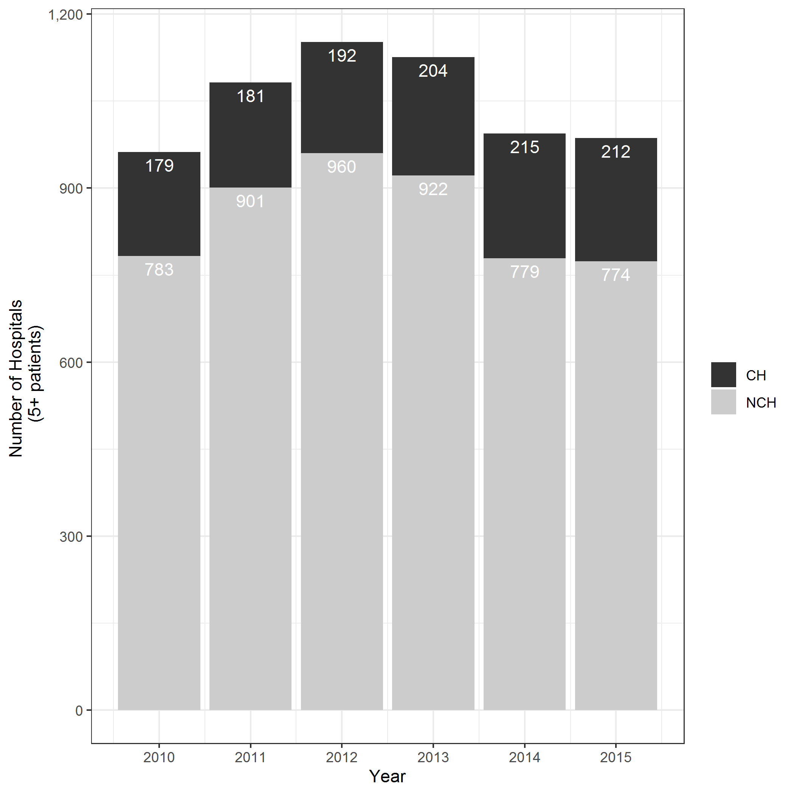
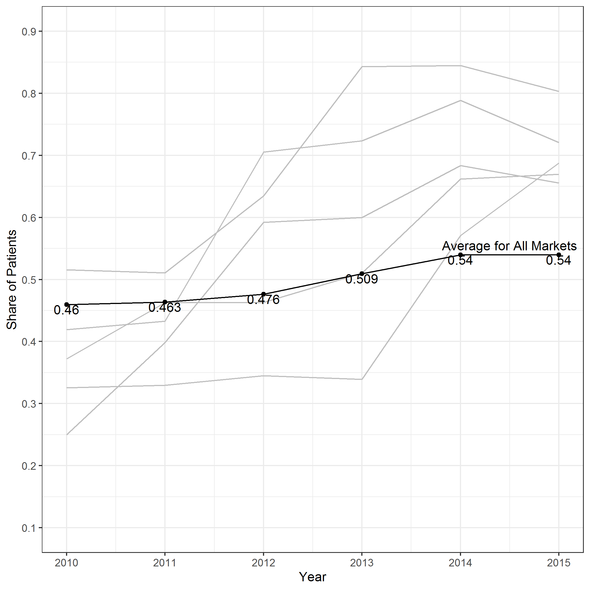
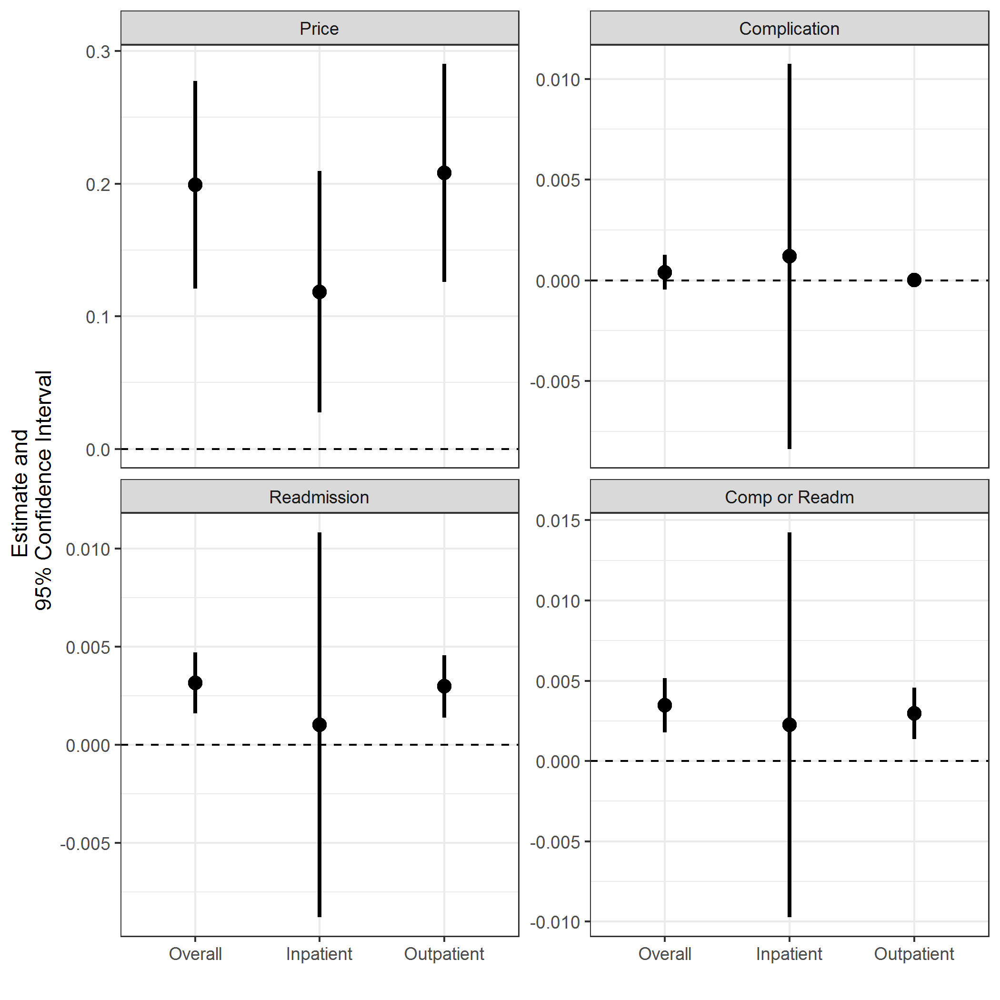
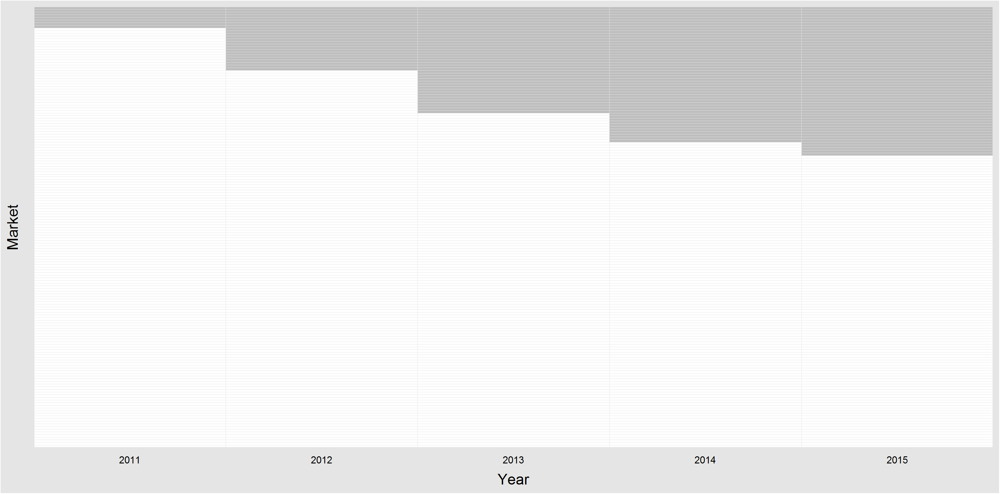
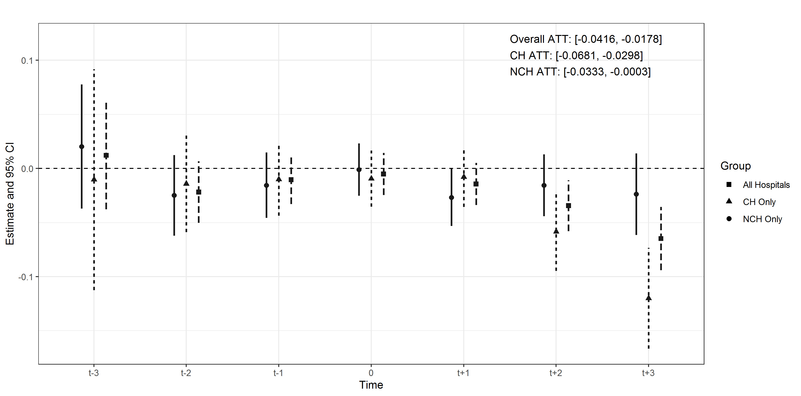
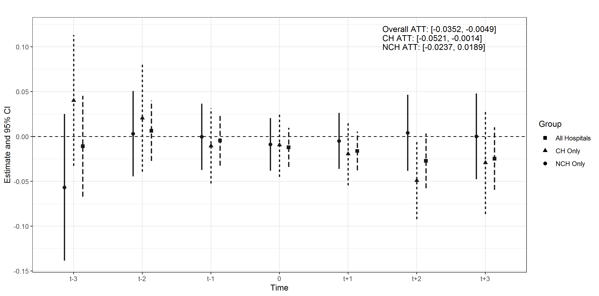
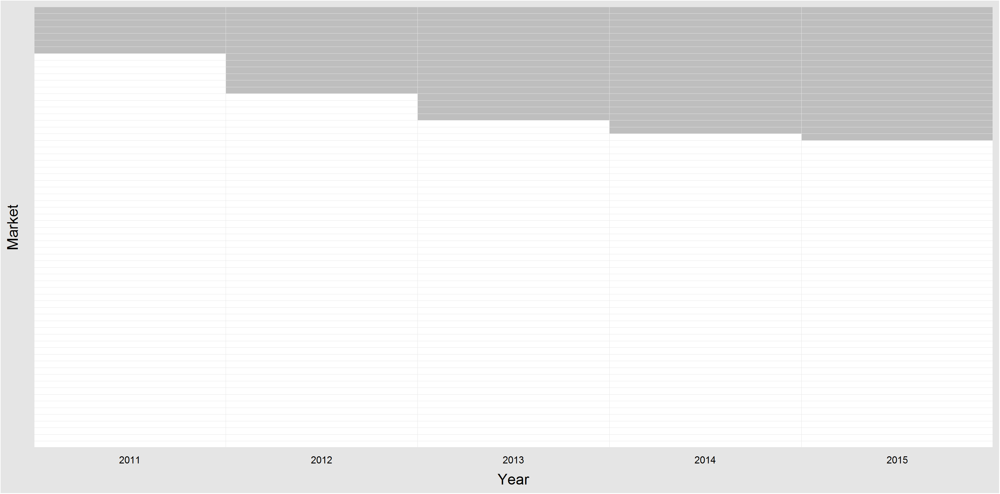
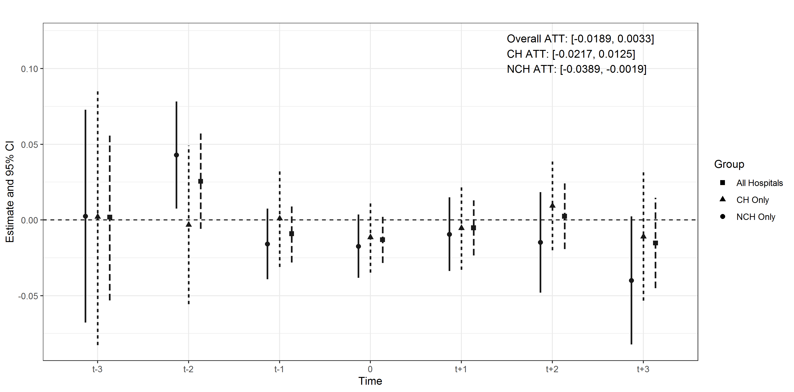

<!-- Adjust some CSS code for font size, maintain R code font size -->
<style type="text/css">
.remark-slide-content {
    font-size: 30px;
    padding: 1em 2em 1em 2em;    
}
.remark-code, .remark-inline-code { 
    font-size: 20px;
}
</style>


<!-- Set R options for how code chunks are displayed and load packages -->
```{r setup, include=FALSE}
options(htmltools.dir.version = FALSE)
options(dplyr.summarise.inform = FALSE)
library(knitr)
opts_chunk$set(
  fig.align="center",  
  fig.height=3, #fig.width=6,
  # out.width="748px", #out.length="520.75px",
  dpi=300, #fig.path='Figs/',
  cache=T#, echo=F, warning=F, message=F
  )

knitr::opts_hooks$set(fig.callout = function(options) {
  if(options$fig.callout) {
    options$echo = FALSE
  }
  options
})

if (!require("pacman")) install.packages("pacman")
pacman::p_load(tidyverse, ggplot2, dplyr, lubridate, readr, readxl, hrbrthemes,scales, gganimate, gapminder, gifski, png, tufte, plotly, OECD, ggrepel, xaringanExtra, webshot, widgetframe)

```


```{r xaringan-scribble, echo=FALSE}
xaringanExtra::use_scribble(rgb(0.9, 0.5, 0.5))
```


```{r include=FALSE}
spec.hosp <- tribble(
  ~"Type", ~"Yr2008", ~"Yr2009", ~"Yr2010", ~"Yr2011",~"Yr2012",~"Yr2013",~"Yr2014",~"Yr2015",
  "Cardiac", 44, 47, 46, 51, 56, 51, 68, 61,
  "Orthopedic", 48, 54, 59, 75, 80, 74, 90, 85,
  "Surgery Center", 62, 68, 69, 84, 82, 82, 100, 86
)
```

# What is a specialty hospital?

> "tend to focus on patients with specific medical conditions or who need surgical procedures"
>`r tufte::quote_footer('-- Government Accountability Office, 2003')`

.pull-left[
**Medical conditions**
- Rehabilitation centers
- Cancer centers
- Long-term care (not SNFs)
- *Children's hospitals*
]

.pull-right[
**Surgical procedures**
- Cardiac hospitals
- Orthopedic hospitals
- Surgery centers
]

---
# Growth of Specialty Hospitals

.center[
```{r echo=FALSE}
spec <- pivot_longer(spec.hosp,
                           cols = starts_with("Yr"),
                           names_to = "Year",
                           names_prefix = "Yr",
                           values_to="Count")
ggplot(spec, aes(Year, Count, group=Type)) +
  geom_line(aes(linetype=Type)) +
  geom_text(data=spec %>% filter(Year==2009),
    aes(label=Type, x=Year, y=Count+1)) +
  theme_bw() +
  ylab("Count of Hospitals") + xlab("Year") +
  guides(linetype="none")
```
]

Data from American Hospital Association Annual Surveys

---
# Concerns about specialty hospitals
- 04-2003, Initial GAO study
- 10-2003, Supplemental GAO study on relationship with CON laws
- 03-2004, Moratorium on self-referrals for physician-owned specialty hospitals (MMA)
- 05-2005, Report on growth of physician-owned specialty hospitals (GAO, HHS, MedPAC)
- 04-2006, GAO report and MedPAC testimony on effects of physician-owned specialty hospitals on general hospitals
- 08-2006, Final HHS report to Congress

---
# Concerns (at the time) related to:

- "Cream-skimming" (probably)
- Self-referrals (small, if at all)
- Foreclosure (not really)

---
# New concerns

> "Patients receiving care from specialty hospitals faced far higher costs, as measured by allowed amounts, when compared to the same services provided at non-specialty hospitals. In general, this wide variation in costs makes care and coverage more expensive for consumers, especially for services that did not always need to be performed at the higher-cost specialty hospital.
>`r tufte::quote_footer('-- AHIP Report on Specialty Hospitals, 2017')`

--

<br>
<br>
Spoiler: We see the same thing in our data

---
# This paper

- **Context:** Set 13 routine pediatric procedures at both Children's Hospitals (standalone or designated unit within larger structure) and non-Children's Hospitals
- **Question:** How are CH able to negotiate higher commercial payments relative to NCH even for routine procedures?

---
class: inverse, center, middle
name: ch

# Understanding Children's Hospitals

<html><div style='float:left'></div><hr color='#EB811B' size=1px width=1055px></html>

---
# 1. Growth

.pull-left[
 
]

.pull-right[

]

---
# 2. Higher prices without higher quality

.pull-left[
<br>
<br>

| Procedure | CH  | NCH  | Difference |
| :-------- | --: | ---: | -----------------: |
| Ear Tubes | 3,899 | 3,045 | 28% |
| Tonsillectomy | 5,474 | 4,218 | 30% | 
| Appendectomy | 14,033 | 10,733 | 31% |
| Overall | 6,280 | 4,874 | 29% |
]

.pull-right[

]

---
# Takeaways

1. More people relying on CH for routine procedures
2. CH much more expensive than NCH (unexplained by quality or patient mix)

---
# Why?

- Multi-product nature of the firm:
  - CH are **really** good at some very difficult procedures
  - Generates spillover effects onto other services
- Potential mechanisms:
  - Demand effect where CH are perceived as better than NCH (most likely)
  - All-or-nothing bargaining effect where CH leverage market exclusivity for one service in negotiations for other services (not really)


---
class: inverse, center, middle
name: demand

# Demand Effect

<html><div style='float:left'></div><hr color='#EB811B' size=1px width=1055px></html>


---
# Idea

- Common in marketing as "umbrella branding"
- Garthwaite (2014): Increased author sales from Oprah endorsement of a different book by the same author


---
# Identification
Exploit changes in competition from same-type (CH/CH or NCH/NCH) versus other-type (CH/NCH or NCH/CH) hospitals

- New CH or NCH structure
- NCH expands into designated pediatric unit (conversion to CH)
- CH or NCH added to network of available commercial insurers

--

<br>
<br>
**Methods note:** Markets constructed using community detection (Everson, 2019), which yields 363 distinct hospital markets for pediatric care

---
# CH events over time

.center[
 
]

---
# Estimand and estimator

$$ATT_{\tau} = \text{E} [ p_{i\tau}^{1} - p_{i\tau}^{0} | \text{Treated}, t=\tau ]$$
1. Residualize allowed amounts: $$p_{i(jhm)t} = \beta_{x} x_{it} + \beta_{z} z_{ht} + \beta_{w} w_{jt} + \beta_{g} g_{mt} + \gamma_{j} + \gamma_{h} + \gamma_{t} + \varepsilon_{i(jhm)t}$$

2. Estimate $ATT$ using Callaway and Sant'anna (2020)


---
# Results of CH entry

.center[
 
]

---
# Results of NCH entry

.center[
 
]

---
class: inverse, center, middle
name: allornothing

# "All-or-nothing" Bargaining

<html><div style='float:left'></div><hr color='#EB811B' size=1px width=1055px></html>


---
# Idea

- Hospitals leverage market power for highly specialized services in negotiation for routine services

---
# Identification

Exploit expansion of hospitals into highly specialized procedures for which existing CH have monopoly

1. Identify CH with monopoly power for ECMO, CHS, brain surgery, or transplant
2. Identify expansions into these service lines (first observed claims from new hospital int he data)


---
# Expansion over time

.center[
 
]

---
# Results of expansion on prices

.center[
 
]


---
class: inverse, center, middle
name: summary

# Takeaways

<html><div style='float:left'></div><hr color='#EB811B' size=1px width=1055px></html>

---
# Empirical findings

1. Much higher prices for routine procedures at specialty hospitals relative to non-specialty hospitals
2. Most likely due to demand effect (non-clinical quality or perceived clinical quality) rather than artifact of all-or-nothing bargaining

---
# Policy implications

1. **Information and transparency:** Patients should understand quality at more granular level than hospital (must be procedure specific)
2. **Competition policy:** In the absence of transparent and accessible information, specialization is a way to avoid competition.
